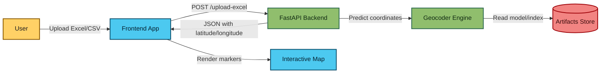
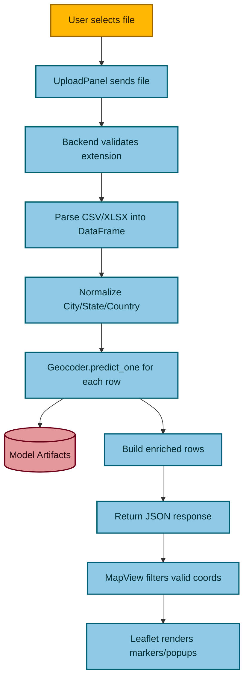
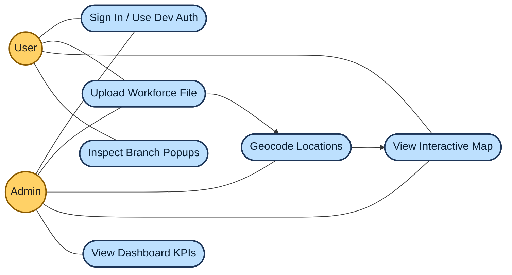
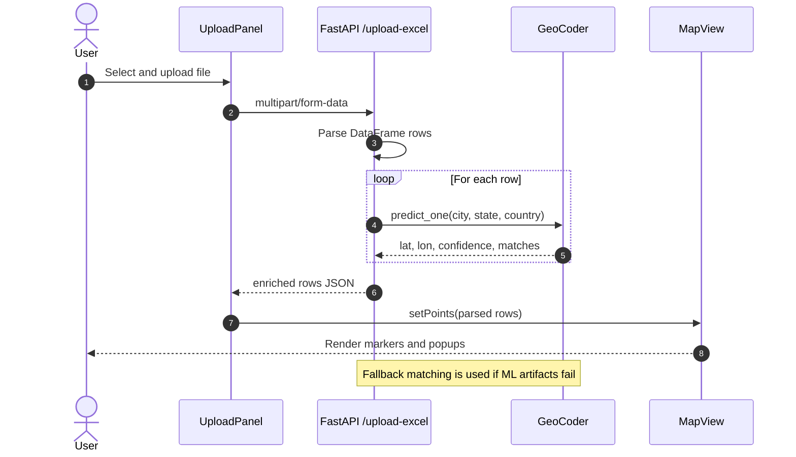
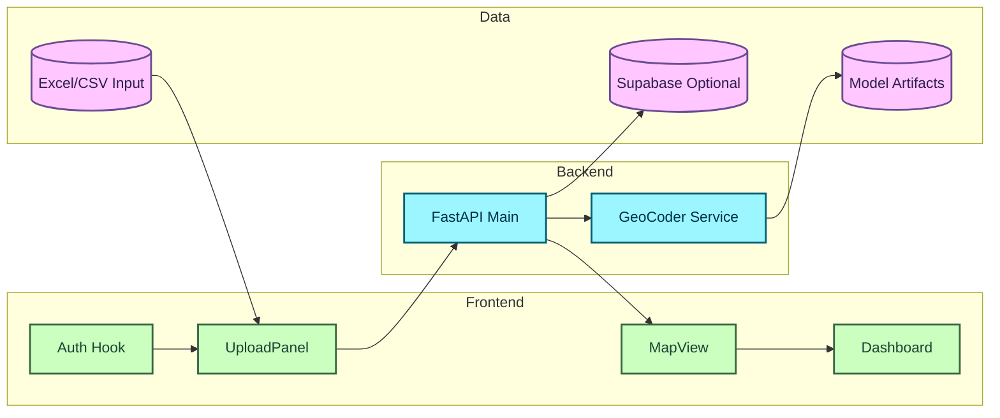

# MapWork

MapWork is a workforce location intelligence app that lets users upload branch/workforce data (Excel/CSV), geocode locations, and visualize global branch distribution on an interactive map.

## Why This Project Exists

Teams often have people and branches distributed across cities, states, and countries, but their data is usually stored in spreadsheets. MapWork converts those records into map coordinates so operations, leadership, and planning teams can quickly understand geographic spread, branch health, and regional concentration.

## Tech Stack

- Frontend: React, TypeScript, Vite, Tailwind CSS, Leaflet
- Backend: FastAPI, Pandas, Scikit-learn, Joblib
- Data: CSV/Excel inputs, model artifacts (`tfidf.pkl`, `nn.pkl`, `index.parquet`)
- Optional persistence: Supabase

## Color DFD (Level 0)



## Color DFD (Level 1 - Upload and Geocode Flow)



## UML Use Case Diagram



## UML Class Diagram (Core Backend + Frontend Data Model)

```mermaid
classDiagram
  class GeoCoder {
    +vec
    +nn
    +idx
    +predict_one(city, state, country, k)
    +_predict_fallback(city, state, country)
  }

  class RowIn {
    +city: str
    +state: str
    +country: str
    +employees: float
    +branches: float
    +meta: dict
  }

  class API {
    +predict_rows(rows)
    +upload_excel(file)
  }

  class UploadPanel {
    +handleUpload(file)
    +onDataLoaded(points)
  }

  class MapView {
    +points: Point[]
    +renderMarkers()
  }

  class Point {
    +lat: number
    +lng: number
    +city: string
    +state: string
    +country: string
    +confidence: number
  }

  API --> GeoCoder : uses
  API --> RowIn : validates
  UploadPanel --> API : calls
  UploadPanel --> Point : maps response
  MapView --> Point : renders

  classDef backend fill:#95d5b2,stroke:#1b4332,color:#081c15,stroke-width:2px
  classDef frontend fill:#a2d2ff,stroke:#1d3557,color:#0b1f33,stroke-width:2px
  classDef model fill:#ffafcc,stroke:#780000,color:#2d0000,stroke-width:2px

  class GeoCoder,RowIn,API backend
  class UploadPanel,MapView frontend
  class Point model
```

## UML Sequence Diagram (Upload to Plot)



## UML Component View



## Run Instructions

### Backend

```powershell
cd backend
python -m uvicorn main:app --reload --port 8000
```

### Frontend

```powershell
cd frontend
npm install
npm run dev
```

- Frontend: http://localhost:5173
- Backend docs: http://127.0.0.1:8000/docs

## Notes

- If the geocoding model artifacts and scikit-learn versions differ, warnings may appear.
- The backend now includes fallback geocoding logic to avoid hard crashes on prediction.
